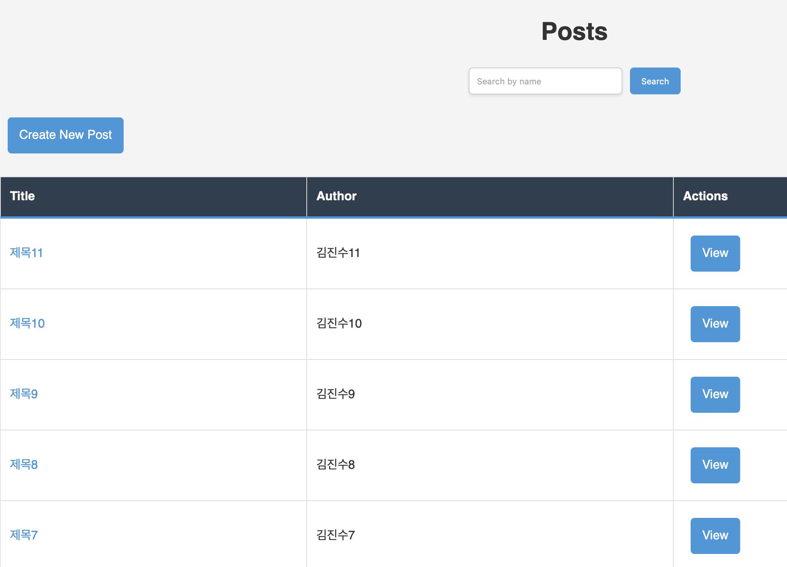
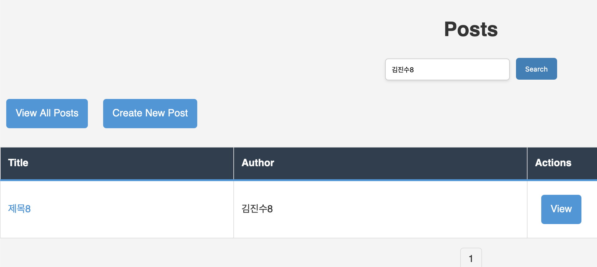
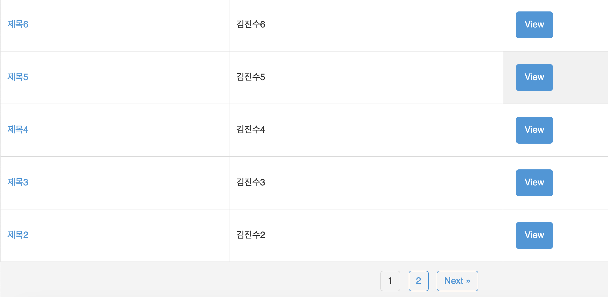
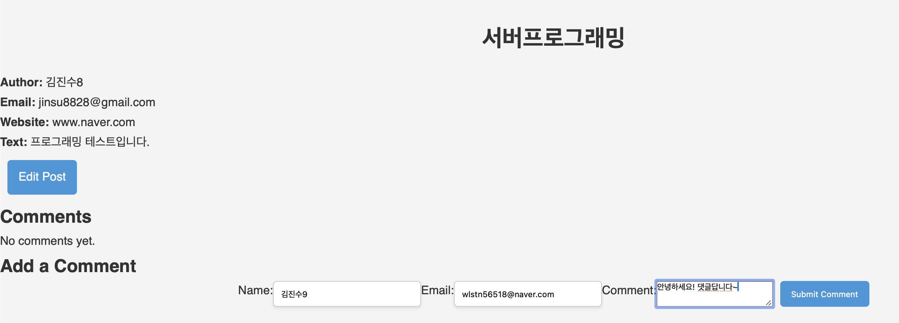
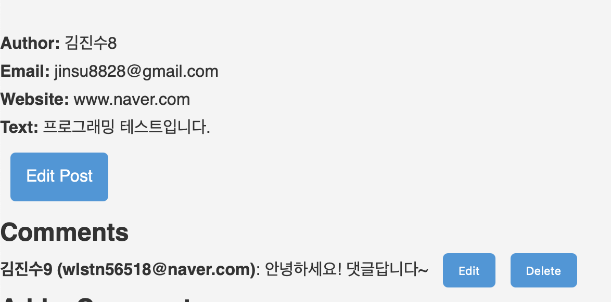
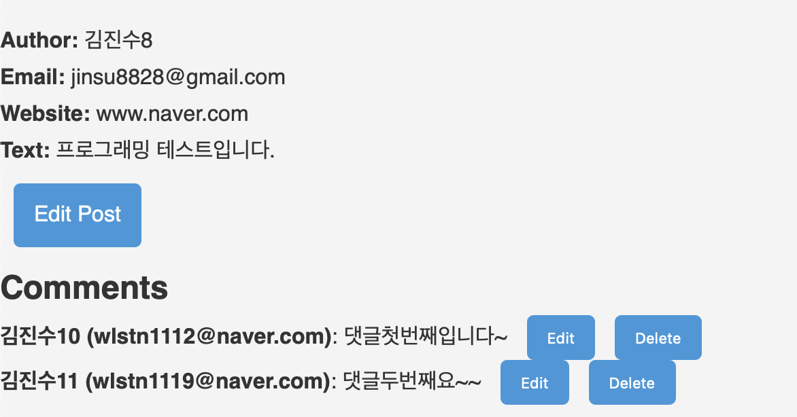
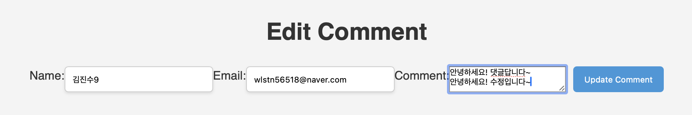
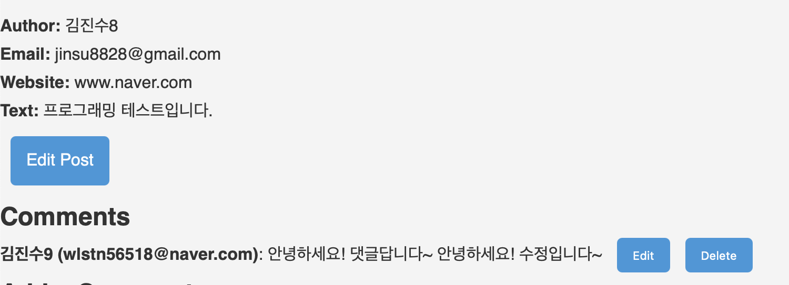
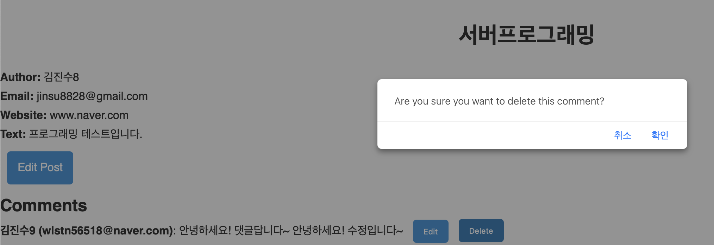
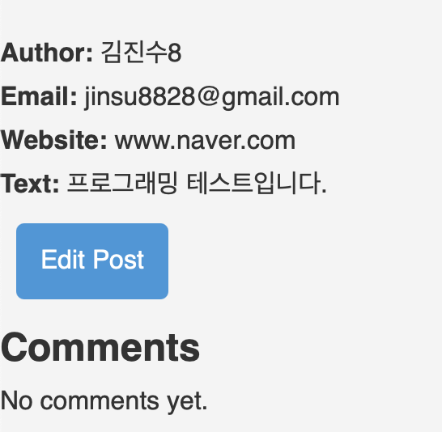

# Embedded-Tomcat-App-Board

이 프로젝트는 **Spring Framework**와 **JPA**를 사용하여 만든 간단한 **게시판** 애플리케이션입니다. 웹 서버 관리는 **Embedded Tomcat**을 사용하여 처리합니다.

## 📖 참고 사이트

이 프로젝트는 개발 과정에서 다양한 기술과 개념을 이해하고 구현하기 위해 **제 개인 Tistory 블로그**를 참조하며 진행되었습니다.  
블로그에는 프로젝트 진행 중 배운 기술 스택이 상세히 기록되어 있습니다.  
더 많은 정보와 저의 개발 여정을 확인하고 싶으시다면, 저의 [Tistory 블로그](https://myinfo503.tistory.com/)를 방문해 주세요!  

## 주요 기능
- 게시물 작성, 조회, 수정, 삭제 (CRUD) 기능 제공
- 게시물에 댓글 추가 가능
- 작성자 및 댓글 정보(예: 이름, 이메일, IP 주소) 저장
- JPA를 통한 사용자와 게시물 간의 관계 관리

## 기술 스택
- **Spring Framework**: 애플리케이션의 전체적인 구조를 관리
- **JPA**: 엔티티와 데이터베이스 간의 객체-관계 매핑 (ORM)
- **Embedded Tomcat**: 내장된 Tomcat 서버를 사용해 애플리케이션 실행
- **MySQL**: 실제 데이터 저장을 위한 관계형 데이터베이스

## 프로젝트 구조
- **Controller**: 요청을 처리하고, 뷰로 데이터를 전달
- **Service**: 비즈니스 로직 처리
- **Repository**: 데이터베이스와의 상호작용을 처리 (JPA 사용)
- **Entity**: `User`, `Post`, `Comment` 등의 엔티티 클래스 정의

## 엔티티 관계
- **User**: 게시물 작성자와 댓글 작성자를 나타냅니다. 하나의 사용자는 여러 개의 게시물과 댓글을 작성할 수 있습니다.
- **Post**: 게시판의 게시물을 나타내며, 각 게시물은 하나의 작성자와 연관되어 있습니다.
- **Comment**: 게시물에 달린 댓글을 나타내며, 하나의 댓글은 하나의 게시물과 하나의 작성자에 속합니다.

## 사용 방법
1. 프로젝트를 클론한 후, **Maven**을 통해 필요한 의존성을 설치합니다.
2. 프로젝트를 실행하면 내장된 Tomcat 서버를 통해 애플리케이션이 실행됩니다.
3. 웹 브라우저에서 `http://localhost:8080`으로 접속하여 게시판 기능을 이용할 수 있습니다.

## 추가 기능
- 페이징 처리
- 게시물 검색 기능 (작성자 기준)

## Entity Class
### 1. **User**
- 게시판의 사용자(작성자)를 나타내는 엔티티입니다.
- 사용자 정보는 `username`, `email`과 같은 필드를 포함하고 있으며, 하나의 사용자는 여러 게시글과 댓글을 작성할 수 있습니다.
- **연관 관계**: `Post` 및 `Comment` 엔티티와 각각 1:N 관계를 맺고 있습니다.
### User Entity Class Code:
```
import java.util.ArrayList;
import java.util.List;

import jakarta.persistence.*;
import jakarta.validation.constraints.Email;
import jakarta.validation.constraints.NotBlank;
import jakarta.validation.constraints.Size;
import lombok.*;

@Getter
@Setter
@NoArgsConstructor
@AllArgsConstructor
@Entity
@Table(name = "users")
public class User extends BaseEntity {

    @Id
    @GeneratedValue(strategy = GenerationType.AUTO)
    @Column(name = "USER_ID")
    private Long id;

    @NotBlank
    @Size(min = 3, max = 50)
    @Column(unique = true, nullable = false)
    private String username;

    @NotBlank
    @Email
    @Column(nullable = false, unique = true)
    private String email;

    @OneToMany(mappedBy = "user", cascade = CascadeType.ALL, orphanRemoval = true)
    private List<Post> posts = new ArrayList<>();

    @OneToMany(mappedBy = "user", cascade = CascadeType.ALL, orphanRemoval = true)
    private List<Comment> comments = new ArrayList<>();

    public void addPost(Post post) {
        post.setUser(this);
        posts.add(post);
    }

    public void removePost(Post post) {
        post.setUser(null);
        posts.remove(post);
    }

    public void addComment(Comment comment) {
        comment.setUser(this);
        comments.add(comment);
    }

    public void removeComment(Comment comment) {
        comment.setUser(null);
        comments.remove(comment);
    }
}
```

### 2. **Post**
- 게시판의 게시글을 나타내는 엔티티입니다.
- 게시글 정보는 `title`, `text`, `email`, `ipAddress`와 같은 필드를 포함하며, 여러 개의 댓글을 가질 수 있습니다.
- **연관 관계**: `User`와 N:1 관계를 맺고 있으며, `Comment`와 1:N 관계를 가집니다.
### Post Entity Class Code:
```
import com.fasterxml.jackson.annotation.JsonManagedReference;
import lombok.AllArgsConstructor;
import lombok.Getter;
import lombok.NoArgsConstructor;
import lombok.Setter;

import jakarta.persistence.*;
import jakarta.validation.constraints.Email;
import jakarta.validation.constraints.Size;
import java.util.ArrayList;
import java.util.List;

@Getter
@Setter
@NoArgsConstructor
@AllArgsConstructor
@Entity
public class Post extends BaseEntity {

    @Id
    @GeneratedValue(strategy = GenerationType.AUTO)
    @Column(name = "POST_ID")
    private Long id;

    @ManyToOne
    @JoinColumn(name = "USER_ID", nullable = false)
    private User user; // 작성자

    @Size(min = 1, max = 100)
    private String name;

    @Size(min = 1, max = 100)
    @Email
    private String email;

    @Column(name = "ip_addr")
    private String ipAddress;

    @Size(min = 1, max = 120)
    private String title;

    @Size(max = 250)
    private String web;

    @Lob
    private String text;

    @JsonManagedReference
    @OneToMany(mappedBy = "post", cascade = CascadeType.ALL, orphanRemoval = true)
    private List<Comment> commentList = new ArrayList<>();

    @JsonManagedReference
    @OneToMany(mappedBy = "post", fetch = FetchType.EAGER, cascade = CascadeType.ALL, orphanRemoval = true)
    private List<FileEntity> files = new ArrayList<>();

    public void addComment(Comment comment) {
        comment.setPost(this);
        commentList.add(comment);
    }

    public void removeComment(Comment comment) {
        comment.setPost(null);
        commentList.remove(comment);
    }

    public void addFile(FileEntity file) {
        file.setPost(this);
        files.add(file);
    }

    public void removeFile(FileEntity file) {
        file.setPost(null);
        files.remove(file);
    }

    public List<FileEntity> getFiles() {
        return files;
    }
}
```

### 3. **Comment**
- 게시물에 달린 댓글을 나타내는 엔티티입니다.
- 댓글 정보는 `text`, `email`, `ipAddress` 등의 필드를 포함하고 있습니다.
- **연관 관계**: `User` 및 `Post`와 각각 N:1 관계를 맺고 있습니다.
### Comment Entity Class Code:
```
import org.hibernate.annotations.DynamicInsert;

import com.fasterxml.jackson.annotation.JsonBackReference;

import jakarta.persistence.*;
import jakarta.validation.constraints.Email;
import jakarta.validation.constraints.Size;
import lombok.AllArgsConstructor;
import lombok.Getter;
import lombok.NoArgsConstructor;
import lombok.Setter;

@Getter
@Setter
@NoArgsConstructor
@AllArgsConstructor
@DynamicInsert
@Entity
@Table(name = "comments")
public class Comment extends BaseEntity implements Comparable<Comment> {

    @Id
    @GeneratedValue(strategy = GenerationType.AUTO)
    @Column(name = "COMMENT_ID")
    private Long id;

    @JsonBackReference
    @ManyToOne
    @JoinColumn(name = "POST_ID", nullable = false)
    private Post post;

    @ManyToOne
    @JoinColumn(name = "USER_ID", nullable = false)
    private User user;

    @Size(min = 1, max = 100)
    private String name;

    @Size(min = 1, max = 100)
    @Email
    private String email;

    @Lob
    private String text;

    @Column(name = "ip_addr")
    private String ipAddress;

    @Override
    public int compareTo(Comment o) {
        if (this.creationDate == null || o.creationDate == null) {
            return 0;
        }
        return this.creationDate.compareTo(o.creationDate);
    }
}
```

## JPA API 적용
- 이 프로젝트는 **JPA API**만을 사용하여 객체와 데이터베이스 간의 매핑을 처리합니다.
- **하이버네이트 API**는 사용하지 않고, 순수 JPA만을 사용하여 데이터베이스 연동을 처리합니다.
- `EntityManager`를 사용해 CRUD 작업 및 쿼리 실행을 수행합니다.
### PostServiceImpl Class Code:
```
import java.util.List;
import java.util.stream.Collectors;
import javax.inject.Inject;
import org.springframework.stereotype.Service;
import org.springframework.transaction.annotation.Transactional;
import org.springframework.web.util.UriComponentsBuilder;
import com.intheeast.dto.PostDto;
import com.intheeast.dto.PostMapper;
import com.intheeast.entity.Post;
import com.intheeast.service.DefaultTextFilter;
import com.intheeast.service.EntityCallback;
import com.intheeast.service.PostService;
import jakarta.persistence.EntityManager;
import jakarta.persistence.PersistenceContext;
import jakarta.persistence.TypedQuery;

@Service
@Transactional
public class PostServiceImpl implements PostService {

    @Inject
    private DefaultTextFilter textFilter;

    @PersistenceContext
    private EntityManager entityManager;

    // 게시글 작성자(userId)로 게시글 조회
    @Override
    @Transactional(readOnly = true)
    public List<Post> findPostsByUserID(Long userId) {
        String jpql = "SELECT p FROM Post p WHERE p.user.id = :userId";
        TypedQuery<Post> query = entityManager.createQuery(jpql, Post.class);
        query.setParameter("userId", userId);
        return query.getResultList();
    }

    // PostDto로 변환하는 메서드
    @Override
    @Transactional(readOnly = true)
    public List<PostDto> findPostsByUserId(Long userId) {
        List<Post> posts = findPostsByUserID(userId);
        return posts.stream()
            .map(PostMapper::toDto)
            .collect(Collectors.toList());
    }

    @Override
    public PostDto findPostById(Long postId) {
        Post post = entityManager.find(Post.class, postId);
        return PostMapper.toDto(post);
    }

    @Override
    public void post(final Post post, final EntityCallback<Post> callback) {
        preparePost(post);
        callback.post(post);
    }

    private void preparePost(final Post post) {
        post.setWeb(cleanupWebUrl(post.getWeb()));
        post.setText(textFilter.filter(post.getText()));
    }

    private String cleanupWebUrl(String webUrl) {
        try {
            return UriComponentsBuilder.fromUriString(webUrl).build().toUriString();
        } catch (Exception e) {
            return webUrl;  // 기본적으로 원래 URL을 반환
        }
    }

    @Override
    @Transactional(readOnly = true)
    public Post findById(Long id, final EntityCallback<Post> callback) {
        return callback.findById(id);
    }

    @Override
    @Transactional(readOnly = true)
    public List<Post> findAll(final EntityCallback<Post> callback) {
        return entityManager.createQuery("SELECT p FROM Post p", Post.class).getResultList();
    }

    @Override
    public void delete(Post post, final EntityCallback<Post> callback) {
        callback.delete(post);
    }

    @Override
    @Transactional(readOnly = true)
    public List<Post> findPostsByPage(int page, int pageSize) {
        int offset = (page - 1) * pageSize;
        return entityManager.createQuery("SELECT p FROM Post p ORDER BY p.creationDate DESC", Post.class)
            .setFirstResult(offset)
            .setMaxResults(pageSize)
            .getResultList();
    }

    @Override
    @Transactional(readOnly = true)
    public long countPosts() {
        return entityManager.createQuery("SELECT COUNT(p) FROM Post p", Long.class).getSingleResult();
    }

    @Override
    @Transactional(readOnly = true)
    public List<Post> searchPostsByName(String name, int page, int pageSize) {
        String jpql = "SELECT p FROM Post p WHERE p.name LIKE :name";
        return entityManager.createQuery(jpql, Post.class)
            .setParameter("name", "%" + name + "%")
            .setFirstResult((page - 1) * pageSize)
            .setMaxResults(pageSize)
            .getResultList();
    }

    @Override
    @Transactional(readOnly = true)
    public long countPostsByName(String name) {
        String jpql = "SELECT COUNT(p) FROM Post p WHERE p.name LIKE :name";
        return entityManager.createQuery(jpql, Long.class)
            .setParameter("name", "%" + name + "%")
            .getSingleResult();
    }

    @Override
    public void update(Post entity, EntityCallback<Post> callback) {
        callback.update(entity);
    }
}
```

## DTO Class 구현
### 1. **UserDto**
- 사용자 엔티티(`User`)의 데이터를 클라이언트와 주고받기 위해 사용되는 DTO 클래스입니다.
- 주요 필드: `username`, `email`, `posts`
### UserDto Class Code:
```
import lombok.AllArgsConstructor;
import lombok.Getter;
import lombok.NoArgsConstructor;
import lombok.Setter;

import jakarta.validation.constraints.Email;
import jakarta.validation.constraints.NotBlank;
import jakarta.validation.constraints.Size;

@Getter
@Setter
@NoArgsConstructor
@AllArgsConstructor
public class UserDto {

    private Long id;

    @NotBlank
    @Size(min = 3, max = 50)
    private String username;

    @NotBlank
    @Email
    private String email;
}
```

### 2. **PostDto**
- 게시글 엔티티(`Post`)의 데이터를 클라이언트와 주고받기 위한 DTO 클래스입니다.
- 주요 필드: `title`, `text`, `email`, `comments`
### PostDto Class Code:
```
import lombok.AllArgsConstructor;
import lombok.Getter;
import lombok.NoArgsConstructor;
import lombok.Setter;

import jakarta.validation.constraints.Email;
import jakarta.validation.constraints.NotBlank;
import jakarta.validation.constraints.Size;
import java.util.List;

@Getter
@Setter
@NoArgsConstructor
@AllArgsConstructor
public class PostDto {

    private Long id;

    private Long userId; // User ID to associate the post with a user

    @NotBlank
    @Size(min = 1, max = 100)
    private String name;

    @NotBlank
    @Email
    private String email;

    @Size(min = 1, max = 120)
    private String title;

    @Size(max = 250)
    private String web;

    @NotBlank
    private String text;

    private String ipAddress;

    private List<CommentDto> commentList;
}
```

### PostMapper 주요 기능:
- **Post 엔티티를 PostDto로 변환 (`toDto`)**:
  - `Post` 엔티티의 필드를 `PostDto`로 매핑.
  - 게시글 작성자의 ID, 이름, 이메일, 제목, 본문 등을 변환.
  - 게시글에 달린 댓글 목록을 `CommentDto`로 변환하여 `PostDto`에 추가.
### PostMapper Class Code:
```
import java.util.stream.Collectors;

import com.intheeast.entity.Post;

public class PostMapper {

    // Post 엔티티를 PostDto로 변환하는 메서드
    public static PostDto toDto(Post post) {
        if (post == null) {
            return null;
        }

        // Post 엔티티의 필드를 PostDto에 매핑
        PostDto postDto = new PostDto();
        postDto.setId(post.getId());
        postDto.setUserId(post.getUser().getId());
        postDto.setName(post.getName());
        postDto.setEmail(post.getEmail());
        postDto.setTitle(post.getTitle());
        postDto.setWeb(post.getWeb());
        postDto.setText(post.getText());
        postDto.setIpAddress(post.getIpAddress());

        // 필요 시 댓글 목록도 변환해서 추가
        if (post.getCommentList() != null) {
            postDto.setCommentList(
                post.getCommentList().stream()
                    .map(CommentMapper::toDto)
                    .collect(Collectors.toList())
            );
        }

        return postDto;
    }
}
```

### 3. **CommentDto**
- 댓글 엔티티(`Comment`)의 데이터를 클라이언트와 주고받기 위한 DTO 클래스입니다.
- 주요 필드: `text`, `email`, `post`
### CommentDto Class Code:
```
import lombok.AllArgsConstructor;
import lombok.Getter;
import lombok.NoArgsConstructor;
import lombok.Setter;

import jakarta.validation.constraints.Email;
import jakarta.validation.constraints.NotBlank;
import jakarta.validation.constraints.Size;

@Getter
@Setter
@NoArgsConstructor
@AllArgsConstructor
public class CommentDto {

    private Long id;

    private Long postId; // ID of the associated post

    private Long userId; // ID of the user who made the comment

    @NotBlank
    @Size(min = 1, max = 100)
    private String name;

    @NotBlank
    @Email
    private String email;

    @NotBlank
    private String text;

    private String ipAddress;
}
```
### CommentMapper 주요 기능:
- **Comment 엔티티를 CommentDto로 변환 (`toDto`)**:
  - `Comment` 엔티티의 필드를 `CommentDto`로 매핑.
  - 댓글 작성자의 ID, 이름, 이메일, 댓글 내용 및 IP 주소 등을 변환.
  - 댓글이 달린 게시물 ID와 작성자 ID도 함께 변환.
### CommentMapper Class Code:
```
import com.intheeast.entity.Comment;

public class CommentMapper {

    // Comment 엔티티를 CommentDto로 변환하는 메서드
    public static CommentDto toDto(Comment comment) {
        if (comment == null) {
            return null;
        }

        CommentDto commentDto = new CommentDto();
        commentDto.setId(comment.getId());
        commentDto.setPostId(comment.getPost().getId());
        commentDto.setUserId(comment.getUser().getId());
        commentDto.setName(comment.getName());
        commentDto.setEmail(comment.getEmail());
        commentDto.setText(comment.getText());
        commentDto.setIpAddress(comment.getIpAddress());

        return commentDto;
    }
}
```

## Logic
### 1. 게시글 작성자 표시
- 게시글을 작성한 사용자의 정보를 게시글과 함께 표시합니다.
- 이를 위해 **`Post` 엔티티**는 **`User` 엔티티**와의 N:1 연관 관계를 통해 작성자 정보를 가지고 있습니다.
- 게시글 조회 시, 해당 작성자의 `username`과 `email`이 함께 출력됩니다.
### PostController Class Code:
```
import com.intheeast.dto.PostDto;
import com.intheeast.entity.Comment;
import com.intheeast.entity.FileEntity;
import com.intheeast.entity.Post;
import com.intheeast.entity.User;
import com.intheeast.service.CommentService;
import com.intheeast.service.EntityCallback;
import com.intheeast.service.PostService;
import com.intheeast.service.UserService;
import com.intheeast.utils.Utilities;

import org.springframework.beans.factory.annotation.Autowired;
import org.springframework.stereotype.Controller;
import org.springframework.ui.Model;
import org.springframework.validation.BindingResult;
import org.springframework.web.bind.annotation.*;

import jakarta.servlet.http.HttpServletRequest;
import jakarta.transaction.Transactional;
import jakarta.validation.Valid;

import java.util.Collections;
import java.util.List;

@Controller
@RequestMapping("/posts")
public class PostController {

    @Autowired
    private PostService postService;

    @Autowired
    private CommentService commentService;

    @Autowired
    private EntityCallback<Post> postCallbackImpl;

    @Autowired
    private EntityCallback<Comment> commentCallbackImpl;
    
    @Autowired
    private UserService userService;  // UserService 주입
    
    // properties 파일에 적용 예상
    private static final int PAGE_SIZE = 10; // 한 페이지에 표시할 게시글 수

 // PostController.java
    @GetMapping("/user/{userId}/posts")
    public String getPostsByUser(@PathVariable Long userId, Model model) {
        List<PostDto> posts = postService.findPostsByUserId(userId);
        model.addAttribute("posts", posts);
        return "post/userPosts"; // 작성자 게시글 목록을 보여줄 뷰 이름
    }
    
    // 게시글 목록 및 검색 기능 추가
    @GetMapping
    public String listPosts(
            @RequestParam(value = "page", defaultValue = "1") int page, 
            @RequestParam(value = "search", required = false) String search, 
            Model model) {

        // 검색 여부에 따라 처리
        if (search != null && !search.isEmpty()) {
            List<Post> posts = postService.searchPostsByName(search, page, PAGE_SIZE);
            long totalPosts = postService.countPostsByName(search);
            int totalPages = (int) Math.ceil((double) totalPosts / PAGE_SIZE);
            
            model.addAttribute("posts", posts);
            model.addAttribute("currentPage", page);
            model.addAttribute("totalPages", totalPages);
            model.addAttribute("search", search); // 검색어 전달
        } else {
            // 기존 게시글 목록 조회
            long totalPosts = postService.countPosts();
            int totalPages = (int) Math.ceil((double) totalPosts / PAGE_SIZE);
            List<Post> posts = postService.findPostsByPage(page, PAGE_SIZE);

            model.addAttribute("posts", posts);
            model.addAttribute("currentPage", page);
            model.addAttribute("totalPages", totalPages);
        }

        return "post/list";
    }

    // 게시글 상세 조회 및 댓글 표시
    @GetMapping("/{id}")
    public String getPostById(@PathVariable("id") Long id, Model model) {
        Post post = postService.findById(id, postCallbackImpl);
        if (post == null) {
            return "post/not_found";
        }

        List<FileEntity> files = post.getFiles();

        List<Comment> comments = commentService.findAllCommentsByPost(post, commentCallbackImpl);
        model.addAttribute("post", post);
        model.addAttribute("comments", comments);
        model.addAttribute("files", files);
        model.addAttribute("comment", new Comment()); // 새 댓글 작성 폼을 위해 빈 객체 추가
        return "post/detail";
    }

    // 게시글 작성
    @GetMapping("/new")
    public String showNewPostForm(Model model) {
        model.addAttribute("post", new Post());
        return "post/new";
    }

//////////////////////////////새로 추가한 부분//////////////////////////////////////
    @PostMapping
    @Transactional // 이 부분 추가
    public String createPost(@Valid @ModelAttribute("post") Post post, 
                             BindingResult result,
                             HttpServletRequest request) {
        if (result.hasErrors()) {
            return "post/new";
        }

        // 클라이언트 IP 주소 설정
        String clientIp = Utilities.getClientIp(request);
        post.setIpAddress(clientIp);
        
        // 사용자 정보를 기반으로 User 객체 생성
        User user = new User();
        user.setUsername(post.getName()); // 이름을 사용자 이름으로 설정
        user.setEmail(post.getEmail()); // 이메일 설정

        // User를 먼저 저장
        userService.save(user); // User 저장 후, ID가 생성됨

        // 저장된 User ID를 Post에 설정
        post.setUser(user); // Post에 User 객체 설정

        // 게시글 저장
        postService.post(post, postCallbackImpl);
        
        return "redirect:/posts";
    }
//////////////////////////////새로 추가한 부분//////////////////////////////////////
    
    // 게시글 삭제
    @PostMapping("/{postId}/delete")
    public String deletePost(@PathVariable("postId") Long postId) {
        Post post = postService.findById(postId, postCallbackImpl);
        if (post != null) {
            postService.delete(post, postCallbackImpl);
        }
        return "redirect:/posts";
    }
//////////////////////////////새로 추가한 부분//////////////////////////////////////
    
    // 댓글 추가
    @PostMapping("/{postId}/comments")
    @Transactional // 이 부분 추가
    public String addCommentToPost(@PathVariable("postId") Long postId, 
                                   @Valid @ModelAttribute("comment") Comment comment, 
                                   BindingResult result, 
                                   HttpServletRequest request, 
                                   Model model) {
        if (result.hasErrors()) {
            return "redirect:/posts/" + postId;
        }

        Post post = postService.findById(postId, postCallbackImpl);
        if (post == null) {
            return "post/not_found";
        }

        // IP 주소 설정
        String clientIp = Utilities.getClientIp(request);
        comment.setIpAddress(clientIp);
        
        // 사용자 정보를 기반으로 User 객체 생성
        User user = new User();
        user.setUsername(comment.getName()); // 이름을 댓글 작성자로 설정
        user.setEmail(comment.getEmail()); // 이메일 설정

        // User를 먼저 저장
        userService.save(user); // User 저장 후, ID가 생성됨

        // 저장된 User ID를 Comment에 설정
        comment.setUser(user); // Comment에 User 객체 설정

        comment.setPost(post); // 댓글에 Post 객체 설정
        commentService.post(comment, commentCallbackImpl);

        return "redirect:/posts/" + postId;
    }
    
    //////////////////////////////새로 추가한 부분//////////////////////////////////////

    // 댓글 수정 폼으로 이동
    @GetMapping("/{postId}/comments/{commentId}/edit")
    public String showEditCommentForm(@PathVariable("postId") Long postId,
                                      @PathVariable("commentId") Long commentId,
                                      Model model) {
        Post post = postService.findById(postId, postCallbackImpl);
        if (post == null) {
            return "post/not_found";
        }

        Comment comment = commentService.findById(commentId, commentCallbackImpl);
        if (comment == null) {
            return "post/not_found";
        }

        model.addAttribute("post", post);
        model.addAttribute("comment", comment);
        return "post/edit_comment";  // 댓글 수정 폼으로 이동
    }

    // 댓글 수정
    @PostMapping("/{postId}/comments/{commentId}/edit")
    public String updateComment(@PathVariable("postId") Long postId,
                                @PathVariable("commentId") Long commentId,
                                @Valid @ModelAttribute("comment") Comment comment,
                                BindingResult result, Model model) {
        if (result.hasErrors()) {
            return "post/edit_comment";  // 에러가 발생하면 수정 폼으로 다시 이동
        }

        Post post = postService.findById(postId, postCallbackImpl);
        if (post == null) {
            return "post/not_found";
        }

        Comment existingComment = commentService.findById(commentId, commentCallbackImpl);
        if (existingComment == null) {
            return "post/not_found";
        }

        // 변경된 필드만 업데이트
        if (!existingComment.getName().equals(comment.getName())) {
            existingComment.setName(comment.getName());
        }
        if (!existingComment.getEmail().equals(comment.getEmail())) {
            existingComment.setEmail(comment.getEmail());
        }
        if (!existingComment.getText().equals(comment.getText())) {
            existingComment.setText(comment.getText());
        }

        // 코멘트 업데이트
        commentService.update(existingComment, commentCallbackImpl);
        return "redirect:/posts/" + postId;  // 수정된 게시글 페이지로 리다이렉트
    }


    // 댓글 삭제
    @PostMapping("/{postId}/comments/{commentId}/delete")
    public String deleteComment(@PathVariable("postId") Long postId,
                                @PathVariable("commentId") Long commentId) {
        Post post = postService.findById(postId, postCallbackImpl);
        if (post == null) {
            return "post/not_found";
        }

        Comment comment = commentService.findById(commentId, commentCallbackImpl);
        if (comment != null) {
            commentService.delete(comment, commentCallbackImpl);
        }

        return "redirect:/posts/" + postId;
    }
    
    @GetMapping("/search")
    public String searchPosts(@RequestParam("search") String search, 
                              @RequestParam(value = "page", defaultValue = "1") int page, 
                              Model model) {
    	// UTF-8로 인코딩된 검색어가 잘 들어오는지 확인
        System.out.println("Search term: " + search);

        long totalPosts = postService.countPostsByName(search);
        int totalPages = (int) Math.ceil((double) totalPosts / PAGE_SIZE);

        List<Post> posts = postService.searchPostsByName(search, page, PAGE_SIZE);

        model.addAttribute("posts", posts);
        model.addAttribute("currentPage", page);
        model.addAttribute("totalPages", totalPages);
        model.addAttribute("search", search);
        return "post/list";
    }

    @GetMapping("/{id}/edit")
    public String showEditPostForm(@PathVariable("id") Long id, Model model) {
        Post post = postService.findById(id, postCallbackImpl);
        if (post == null) {
            return "post/not_found";  // 게시글이 없을 경우 에러 페이지로 이동
        }

        model.addAttribute("post", post);  // 수정할 게시글을 모델에 추가
        return "post/edit";  // 수정 폼을 렌더링할 JSP로 이동
    }
    
    @PostMapping("/{id}/edit")
    public String updatePost(@PathVariable("id") Long id, 
                             @Valid @ModelAttribute("post") Post post, 
                             BindingResult result, 
                             HttpServletRequest request, 
                             Model model) {
        if (result.hasErrors()) {
            return "post/edit";  // 에러가 발생하면 수정 폼으로 다시 이동
        }

        String clientIp = Utilities.getClientIp(request);  // 클라이언트 IP 가져오기

        Post existingPost = postService.findById(post.getId(), postCallbackImpl);
        if (existingPost == null) {
            return "post/not_found";
        }

        // 변경된 값만 설정
        if (!existingPost.getName().equals(post.getName())) {
            existingPost.setName(post.getName());
        }
        if (!existingPost.getTitle().equals(post.getTitle())) {
            existingPost.setTitle(post.getTitle());
        }
        if (!existingPost.getWeb().equals(post.getWeb())) {
            existingPost.setWeb(post.getWeb());
        }
        if (!existingPost.getText().equals(post.getText())) {
            existingPost.setText(post.getText());
        }
        if (!existingPost.getIpAddress().equals(clientIp)) {
            existingPost.setIpAddress(clientIp);
        }

        // 게시글 업데이트
        postService.update(existingPost, postCallbackImpl);

        return "redirect:/posts/" + id;  // 수정된 게시글 페이지로 리다이렉트
    }

}
```

### 2. 작성자 게시글 검색
- 특정 작성자의 게시글을 검색할 수 있는 기능을 제공합니다.
- JPA를 사용하여 작성자의 이름을 기준으로 게시글을 조회할 수 있습니다.
#### JPQL 쿼리 예시: PostServiceImpl Class 참고
  ```jpql
  SELECT p FROM Post p WHERE p.user.username = :username
  ```
#### 실행 화면
##### 작성자 '김진수'의 1번부터 11번까지 게시글 목록

##### 작성자 '김진수8'의 게시글 검색 기능


  ### 3. Page 표시
- 게시물 목록은 **페이지네이션** 기능을 통해 일정 개수씩 나누어 보여줍니다.
- 페이지네이션은 **JPA**에서 제공하는 `Query` 객체의 `setFirstResult`와 `setMaxResults` 메서드를 사용하여 구현됩니다.
- 이를 통해 원하는 페이지의 게시글만 조회할 수 있으며, 한 페이지에 표시될 게시글 수를 설정할 수 있습니다.

#### 페이지네이션 JPQL 예시: PostServiceImpl Class 참고
```java
TypedQuery<Post> query = entityManager.createQuery("SELECT p FROM Post p", Post.class);
query.setFirstResult(0); // 첫 페이지의 첫 번째 게시글
query.setMaxResults(10); // 한 페이지에 10개의 게시글 표시
List<Post> posts = query.getResultList();
```

#### 실행 화면
##### 게시글 10개 초과 시 자동 페이지 분할


### 댓글(Comment) 기능

댓글 기능은 게시물에 대해 사용자들이 의견을 남길 수 있도록 지원하는 기능입니다. 각 댓글은 특정 게시물에 연결되며, 작성자 정보와 함께 저장됩니다.

#### 주요 특징:
- **작성자 정보**: 각 댓글은 작성자의 ID, 이름, 이메일 정보를 포함하고 있습니다.
- **댓글 내용**: 댓글의 본문(`text`)과 IP 주소(`ipAddress`)도 함께 저장됩니다.
- **게시물과의 연관 관계**: 댓글은 반드시 하나의 게시물에 속하며, 이를 위해 `Post`와 N:1 관계를 형성합니다.

#### 연관 관계:
- **Post와의 관계**: 댓글은 `Post`와 N:1 관계를 가집니다. 즉, 여러 개의 댓글이 하나의 게시물에 속합니다.
- **User와의 관계**: 댓글은 작성자를 나타내는 `User`와 N:1 관계를 맺고 있으며, 한 사용자가 여러 개의 댓글을 작성할 수 있습니다.
  
#### 주요 기능:
**댓글 작성**: 사용자가 특정 게시물에 댓글을 작성할 수 있습니다.
#### 실행 화면
##### 댓글 작성 폼이 표시되어, 사용자가 댓글 내용을 입력

##### 댓글 제출

**댓글 조회**: 게시물에 달린 모든 댓글을 조회하여 사용자와 함께 표시할 수 있습니다.
#### 실행 화면
##### 게시물에 달린 모든 댓글이 목록으로 표시되며, 각 댓글의 작성자와 내용이 함께 나타납니다.


**댓글 수정**: 사용자가 작성한 댓글을 수정할 수 있습니다.

#### 실행 화면
##### 사용자가 기존에 작성한 댓글을 수정할 수 있는 폼이 표시됩니다. 댓글의 내용을 수정하고 "수정" 버튼을 눌러 댓글을 업데이트할 수 있습니다.

##### 수정된 댓글이 성공적으로 저장된 후, 수정된 내용이 게시물에 반영됩니다.


**댓글 삭제**: 댓글을 작성한 사용자가 댓글을 삭제할 수 있습니다.

#### 실행 화면
##### 댓글 삭제 버튼을 눌러 댓글을 삭제하는 화면입니다.

##### 댓글이 삭제된 후, 댓글 목록에서 해당 댓글이 사라진 것을 확인할 수 있습니다.

